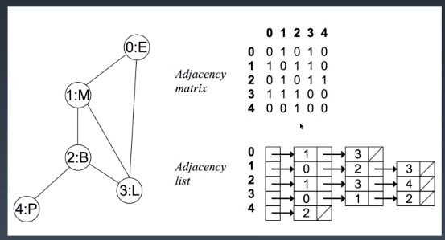

# 学习笔记

[TOC]

## 哈希表

哈希表（散列表），通过关键码值进行访问的数据结构。  
将关键码值映射到表中的一个位置来访问记录，以加快查询速度。
增加、删除、查询的时间复杂度为O(1)

### 散列函数

1. 散列函数计算得到的散列值是一个非负整数；
2. 如果 key1 = key2，那 hash(key1) == hash(key2)；
3. 如果 key1 ≠ key2，那 hash(key1) ≠ hash(key2)。

### 散列冲突

1. 开放寻址法
    如果出现了散列冲突，我们就重新探测一个空闲位置，将其插入。
2. 链表法
    当插入的时候，我们只需要通过散列函数计算出对应的散列槽位，将其插入到对应链表中即可,最坏的情况下查询时间复杂度会退化为O(n)

## 树


- 父节点
- 子节点
- 兄弟节点
- 根节点：没有父节点的节点
- 叶子节点：没有子节点的节点


### 二叉树

节点只有只有两个子节点的树

```go
type BinaryTreeNode struct {
    Val interface{}
    Left *BinaryTreeNode
    Right *BinaryTreeNode
}
```

#### 二叉树遍历

- 前序
    根-左-右

    ```python
    def preorder(self, root):
        if root:
            self.traverse_path.append(root.val)
            self.preorder(root.left)
            self.preorder(root.right)
    ```

- 中序
    左-根-右

    ```python
    def inorder(self, root):
        if root:
            self.inorder(root.left)
            self.traverse_path.append(root.val)
            self.inorder(root.right)
    ```

- 后续
    左-右-根

    ```python
    def postorder(self, root):
        if root:
            self.postorder(root.left)
            self.postorder(root.right)
            self.traverse_path.append(root.val)
    ```

#### 二叉搜索树

1. 左子树上的所有节点值小于根节点的值
2. 右子树的所有节点值大于根节点的值
3. 一次类推左右子树也分别为二叉搜索树

二叉搜索树的中序遍历结果为升序排列

- 查询
  查询时间复杂度$O(logn)$
- 插入
  首先查找节点，如果没找到，则在该位置添加
- 删除
  - 叶子节点，直接删除
  - 删除该节点，并用右子树中最小的节点进行替换

## 堆

可以迅速找到一堆数中最大或者最小的数据结构，常见的堆有二叉堆，斐波拉契堆

- 大顶堆：根节点最大的堆，也叫大根堆
- 小顶堆：根节点最小的堆

find-max: O(1)
delete-max：O(logn)
insert：O(logn) 或者 O(1)

### 二叉堆

1. 完全二叉树
2. 任意节点值大于等于其子节点的值

- 二叉堆一般使用数组来实现，假设“第一个元素“在数组中的索引为0，则父节点和子节点的关系如下
  - 索引为i的左孩子索引为（2*i+1）
  - 所以未i的有孩子索引为（2*i+2）
  - 索引为i的父节点的索引为floor（（i-1）/ 2）

插入：

1. 新元素插入到堆的尾部
2. 依次向上调整堆的结构（如果大于父亲节点，交换位置）

删除最大元素：

1. 将堆尾元素替换到顶部
2. 依次从根向下调整堆的结构（和较大的子节进行交换）

## 图

1. 有点
2. 有边

$Graph(V,E)$, 其中$V$表示点，$E$表示边

### 点

- 度
    度分为入度和出度，入度，指向点的边，出度，指出的边

### 边

- 边分有向边和无向边
- 边具有权重

### 数据结构表示

1. 邻接矩阵
2. 邻接表



### 常见算法

- 深度优先遍历

```python
visited = set()

def dfs(node, visited):
    if node in visited: # 如果被访问过，退出
        return
    visited.add(node)

    # 当前点的处理

    for next_node in node.children():
        if not next_node in visited:
            dfs(next_node, visited)
```

- 广度优先遍历

```python
def bfs(graph, start, end):
    queue = []
    queue.append([start])

    visited = set()
    while queue:
        node = queue.pop()
        visited.add(node)
        # 当前点的处理
        nodes = generate_related_nodes(node)
        queue.push(nodes)
```

- 连通图个数： https://leetcode-cn.com/problems/number-of-islands/
- 拓扑排序（Topological Sorting）： https://zhuanlan.zhihu.com/p/34871092
- 最短路径（Shortest Path）：Dijkstra https://www.bilibili.com/video/av25829980?from=search&seid=13391343514095937158
- 最小生成树（Minimum Spanning Tree）： https://www.bilibili.com/video/av84820276?from=search&seid=17476598104352152051