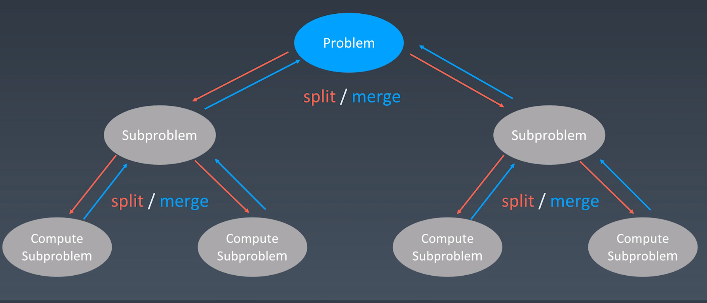

# 学习笔记

## 递归

递归本质是一种循环，通过函数体调用自身来进行循环  

```go
// 递归代码模板
func recursion(level int, params ... interface{}) {
    // 递归的终止条件
    if level > max_level {
        // 结果处理，并返回
        return
    }
    // 当前层的逻辑处理 
    process(level, params)
    // 进入下一层
    recursion(level + 1, params)
    // 清理当前层的状态
    cleanup()
}
```

- **不要人肉递归**
- **找到最近最简方法，将其拆分成重复子问题**
- **数学归纳法的思维**

## 分治

将一个问题划分为多个子问题，将子问题处理完成之后合并为大问题



```go
// 分治代码模板
func divide_conquer(problem interface{}, params ... interface{}){
    if problem == nil {
        // 处理结果，退出递归
        return
    }
    data :=prepare_data()
    subproblems := splite_problem(problem)

    // 处理子问题
    for _, subproblem := range subproblems {
        subresult := append(subresult, divide_conquer(subproblem, params))
    }

    // 合并子问题的结果为最终的问题
    result = merge_result(subresult)
    // 清理状态
    cleanup()
    return result
}
```

## 回溯

采用试错的思想，分步的去解决问题，如果在某一步中发现问题无法解决，退回上一步甚至几步去解决，并尝试其他的可能的方法。
