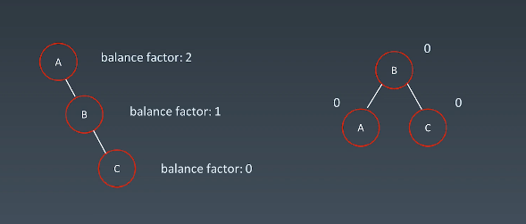
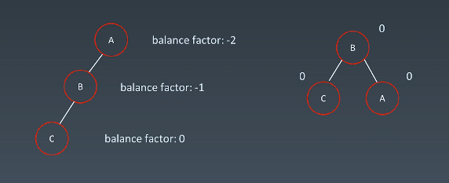
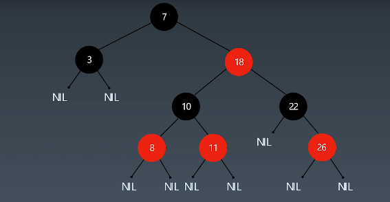

# 学习笔记

## 字典树 （Trie）

典型的应用是用于统计和排序大量的字符串（但不仅限于字符串），所以将常被搜索引擎用于文本词频统计。

优点是：最大限度的减少无谓的字符串比较，查询效率比hash表高  

基本性质：

1. 节点本身不保存完整的单词
2. 从根节点到某一结点，路径上经过的字符连接起来为该节点对应的字符串
3. 每个节点的所有子节点路径代表的字符按都不相同

核心思想：空间换时间

## 并查集

```go [Golang-并查集]
type UnionFind struct {
    Count  int
    parent []int
}

func (unionFind *UnionFind) find(p int) int {
    for p != unionFind.parent[p] {
        unionFind.parent[p] = unionFind.parent[unionFind.parent[p]]
        p = unionFind.parent[p]
    }
    return p;
}

func (unionFind *UnionFind) Union(x, y int) {
    int rootP = unionFind.find(p)
    int rootQ = unionFind.find(q)
    if rootP == rootQ {return}
    parent[rootP] = rootQ
    count--;
}

func NewUnionFind(n int) *UnionFind {
    uf = UnionFind{
        Count:  n,
        parent: make([]int, n),
    }
    for i := 0; i < n; i++ {
        uf.parent[i] = i
    }

    return &uf
}
```

## 双向BFS

## 启发式搜索

基于BFS，使用优先队列

启发式函数：用于评价哪些节点最有希望的是我们要找的节点

## AVL树

https://en.wikipedia.org/wiki/AVL_tree

平衡因子：左子树减去右子树高度{-1，0，1}
通过旋转平衡

- 左旋
- 右旋
- 左右旋
- 右左旋

子树形态

1. 右右子树 -> 左旋

2. 左左子树 -> 右旋

3. 左右子树 -> 左右旋
4. 右左子树 -> 右左旋

*需要额外存储信息，且调整次数频繁*

## 红黑树

近似平衡二叉树，任何节点的左右子树高度差小于2倍

- 每个节点要么是红色，要么是黑色
- 根节点是黑色
- 叶子节点（nil节点，空节点）是黑色
- 不能有相邻的两个红色节点
- 从任意节点到其每个叶子节点的所有路径都包含相同数目的黑色节点


